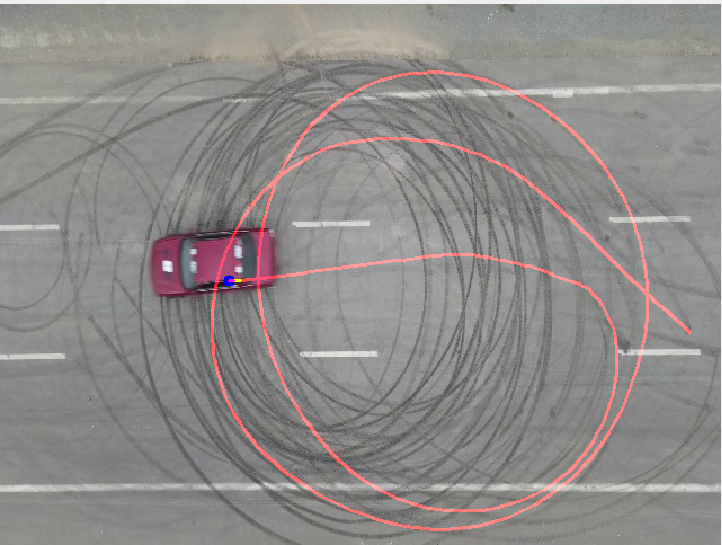
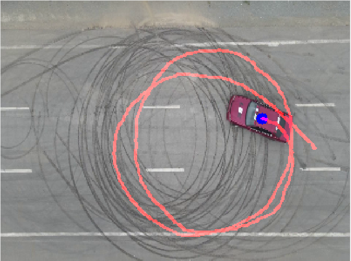

# 🚗 Suivi de trajectoire par flux optique (Optical Flow)




## 📌 Description du projet

Ce projet montre comment **suivre la trajectoire d’un objet en mouvement dans une vidéo** en utilisant des techniques de **flux optique avec OpenCV**.

Deux approches sont implémentées :

1. **Lucas-Kanade (Sparse Optical Flow)**  
   - Suivi d’un point sélectionné manuellement  
   - Calcul du déplacement du point image par image  

2. **Farneback (Dense Optical Flow)**  
   - Détection automatique des zones en mouvement  
   - Calcul du centre de masse du mouvement  
   - Tracé automatique de la trajectoire  

Le projet est développé en **Python**, en utilisant **OpenCV** et **NumPy**.

---

## 🧠 Objectifs

- Comprendre le principe du flux optique  
- Suivre la trajectoire d’un objet en mouvement  
- Comparer une méthode sparse (Lucas-Kanade) et une méthode dense (Farneback)  

---


## Installation
### 1 Cloner le projet :

```bash
git clone https://github.com/erraguibiabdelilah/vehicle-speed-estimator.git
cd vehicle-speed-estimator
```
    

### Créer un environnement virtuel (optionnel mais recommandé) :

```bash
python -m venv venv
source venv/bin/activate   # Linux / Mac
venv\Scripts\activate      # Windows
```


###Installer les dépendances :
```bash
pip install opencv-python numpy
```


##Exécution du projet
###🔹 Méthode 1 : Lucas-Kanade (point manuel)
```bash python lucas_kanade.py 
```
-La vidéo car2.mp4 est chargée

-Un point initial est défini manuellement dans le code

-La trajectoire est tracée en rouge

-Le vecteur de déplacement est affiché en vert

###🔹 Méthode 2 : Farneback (automatique)
```bash python farneback_auto.py
```
-Le mouvement est détecté automatiquement

-Le centre de masse du mouvement est calculé

-La trajectoire est tracée sans intervention manuell


